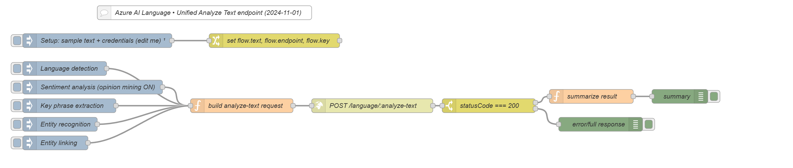

# Sentiment & Text Analytics (Azure AI Language) — AnywhereNow Dialogue Studio

A minimal, import-and-run flow to test your Azure connectivity and key, and to try the **Analyze Text** API for:

* **Language detection**
* **Sentiment analysis** (with optional opinion mining)
* **Key phrase extraction**
* **Named entity recognition**
* **Entity linking** (maps entities to a knowledge base)

The flow comes with sample text, easy triggers, and a compact summary output for quick validation.



---

## What this flow uses

* **Endpoint (choose one):**

  * **Multi-service (regional)**: `https://<region>.api.cognitive.microsoft.com` (e.g., `https://westeurope.api.cognitive.microsoft.com`)
  * **Resource-scoped**: `https://<your-language-resource>.cognitiveservices.azure.com`
* **API path:** `POST {Endpoint}/language/:analyze-text?api-version=2024-11-01`
* **Auth:** `Ocp-Apim-Subscription-Key: <your key>` (or use OAuth Bearer token later)
* **Content-Type:** `application/json`

---

## Import & configure

1. **Import**
   In Dialogue Studio (Node-RED): **Menu → Import**, paste the `.json` flow (or select the file) → **Import** → **Deploy**.

2. **Set your settings**
   In the **Setup** Change node:

   * `flow.endpoint` → your endpoint (multi-service or resource-scoped)
   * `flow.key` → your Azure AI key
   * (Optional) `flow.text` → your sample text

3. **That’s it** — no other nodes need edits for a quick test.
   For production, consider moving secrets to credentials or a vault.

---

## Run the analyses

Use the inject nodes on the left:

* **Language detection** → returns detected language + confidence
* **Sentiment analysis (opinion mining ON)** → document sentiment (+ per-sentence if you extend the summarizer)
* **Key phrase extraction** → important phrases
* **Entity recognition** → entities with categories + confidence
* **Entity linking** → entities mapped to URLs (e.g., Wikipedia)

Results appear in two Debug outputs:

* `summary` → compact, human-readable
* `error/full response` → full JSON (useful for larger payloads or troubleshooting)

---

## Request shapes (important)

The flow automatically sends the correct **analysisInput** shape per kind:

* **LanguageDetection**

  ```json
  { "analysisInput": { "documents": [ { "id": "1", "text": "..." } ] } }
  ```

  > No `language` field here.

* **Other kinds (Sentiment/KeyPhrases/Entities/Linking)**

  ```json
  { "analysisInput": { "documents": [ { "id": "1", "text": "...", "language": "en" } ] } }
  ```

  * If you set `msg.language` (e.g., `"en"`, `"nl"`, `"pt-PT"`, `"zh-Hans"`), it’s included.
  * If you omit `msg.language`, the request excludes the field (recommended when unsure).
  * **Do not** send `"language": "auto"` — it’s not accepted for these kinds.

---

## Tips & common pitfalls

* **400 “Invalid Language Code: auto”**
  Don’t send `"auto"` except in preview features that explicitly allow it. Leave `language` out or set an actual code.
* **200 but empty results**
  Very short texts can be hard to analyze. Try a longer sentence or add more context.
* **429 (throttling)**
  Back off and retry using the `Retry-After` header. Batch requests when possible.
* **401/403**
  Check the key (or Bearer token) and that you’re targeting the correct endpoint region/resource.

---

## Next steps

* Chain **Language detection → Sentiment**: save the detected ISO code to `msg.language`, then call Sentiment for improved accuracy.
* Persist results: swap the Debug node for a database write (SQL/Elastic). Feed dashboards like Power BI or Grafana.
---
