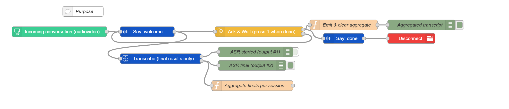

# Minimal Transcribe to Debug

### AnywhereNow Dialogue Studio

A tiny, reliable flow to capture speech-to-text results and print them to Debug.
Callers speak, then **press 1** to finish. You’ll see each transcript as it arrives and a **single aggregated transcript** at the end of the call.

---

## What this flow does

1. **Welcome prompt** → “Describe your issue, then press 1 when finished.”
2. **Transcription** → text is emitted by the transcriptor on its second output.
3. **Press 1 to finish** → emits a single, concatenated transcript object and ends the call.

**Outputs in Debug:**

* **ASR transcript (output #2):** `msg.payload.transcriptor.transcript` → text chunks
* **Aggregated transcript:** `msg.aggregate` → `{ sessionId, pieces[], text, length, words }`

> Note: The transcriptor’s **output #1** is a *started* signal (no text) and is disabled by default in this sample.

---

## Requirements

* An active **UCC** and access to **Dialogue Studio**
* **Transcription** configured for your environment (Microsoft or Google)

---

## Import & first run

1. In Dialogue Studio: **Menu → Import** → paste the JSON → **Import** → **Deploy**.
2. In **Incoming Call**, set your **Server** and **UCC**.
3. In **Transcriptor**, set **culture** (e.g., `en-US`, `nl-NL`).
4. Call the flow, speak a sentence or two, then **press 1**.

**What you’ll see in Debug**

* `ASR transcript (output #2)` → e.g., “My VPN disconnects every hour.”
* `Aggregated transcript` → `{ text: "My VPN disconnects every hour. It started yesterday.", words: 9, … }`

---

## How it works (node map)

* **Say: welcome** → prompt
* **Transcribe** → emits transcripts on **output #2**

  * Output #2 → transcript → **ASR transcript** debug + **Aggregate transcripts per session**
* **Ask & Wait (press 1 when done)** → on DTMF `1`:

  * **Emit & clear aggregate** → **Aggregated transcript** debug
  * **Say: done** → goodbye → **Disconnect**

The aggregator stores pieces under `flow` per `session.id`, so each call yields one clean `msg.aggregate` at the end.

---

## Customize

* **Culture**: adjust the Transcriptor culture to match callers.
* **DTMF key**: in **Ask & Wait**, set `tone` to `#` (or another digit).
* **Timeout/reprompt**: increase `timeout` or set `repeatdelay` for longer recordings.
* **Persist results**: replace the “Aggregated transcript” Debug with a DB/API call (store `sessionId`, timestamp, caller, `aggregate.text`).
* **Start logging**: enable the **“ASR started (output #1)”** Debug if you want to log when the transcriptor activates.

---

## Tips

* Keep prompts short and explicit: *“Describe your issue, then press 1 when finished.”*
* For multilingual traffic, duplicate the flow for other **cultures**, or detect language upstream and route accordingly.
* If you need timestamps, extend the aggregator to add times per transcript piece.

---

## Troubleshooting

* **No transcripts** → verify STT credentials and **culture**; ensure audio is flowing.
* **Nothing when pressing 1** → check **Ask & Wait** `tone` and `tonecount`.

---