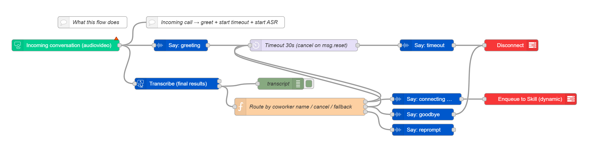

# Voice Forward to Coworker

### AnywhereNow Dialogue Studio (Node-RED)

Route callers to a coworker by saying their first name (e.g., *“Linda”*, *“Kevin”*, *“Tom”*).
The flow greets, listens, confirms, and **enqueues to a Skill**. It includes:

* Case-insensitive name matching with simple aliases (e.g., *Thom* → **Tom**)
* **Dynamic** speech (`msg.speech`) and skill (`msg.skill`) → no hard-coded values in nodes
* Up to **2 reprompts**, then escalation to **ReceptionSkill**
* A **timeout** after \~30s of silence (with a recommended cancellable setup)
* Basic **cancel** intents (*cancel/stop/hang up/bye…*) that politely disconnect



---

## Prerequisites

* An active **UCC** and Dialogue Studio access
* **Transcription** enabled on your UCC (Google or Microsoft supported STT)
  See your platform docs for enabling credentials and culture selection.
* **Skills** configured in your UCC:

  * `LindaSkill`, `KevinSkill`, `TomSkill` (and optionally `ReceptionSkill`)

> Note: Person names are notoriously hard for STT. Phrase requests in context (“**Can I speak to Tom please?**”) to improve accuracy.&#x20;

---

## Import & first run

1. **Import** the JSON into Dialogue Studio (Menu → **Import** → paste → **Import** → **Deploy**).
2. In the **Incoming Call** node, set your **Server** and **UCC**.
3. In the **Transcriptor** node, pick the right **culture** (e.g., `en-US`, `nl-NL`).
4. Make sure the Skills referenced in the flow **exist** and agents are assigned.

Open the **Debug** panel to see what the ASR heard:

```
msg.payload.transcriptor.transcript  →  "I'd like to speak to Kevin."
```

If a skill is missing you’ll see an enqueue error in Debug (create/assign the skill, then test again).&#x20;

---

## How it works (at a glance)

1. **Greet**: prompts for “Linda, Kevin, or Tom… you can also say cancel.”
2. **Listen** (Transcriptor): emits a final transcript on silence or end of utterance.
3. **Route by name** (Function):

   * Normalizes text, checks **cancel** phrases
   * Matches against a small **contacts** list (aliases + word boundaries)
   * On match: sets `msg.person`, `msg.skill`, `msg.speech`
   * On no match: increments an **attempts** counter (stored per session)
     → reprompt (max 2), then **escalate** to `ReceptionSkill`
4. **Confirm** (Say) and **Enqueue** (Action).
5. **Timeout**: if nobody speaks for \~30s, a polite goodbye and disconnect.

---

## Configuration you’ll likely change

* **Contacts** list (in the “Route by coworker name …” Function):

  ```js
  const contacts = [
    { key: 'Linda', skill: 'LindaSkill', aliases: ['linda','lynda'] },
    { key: 'Kevin', skill: 'KevinSkill', aliases: ['kevin'] },
    { key: 'Tom',   skill: 'TomSkill',   aliases: ['tom','thom','tommy'] }
  ];
  ```

  Add more coworkers or tweak aliases.
* **Culture** in the Transcriptor (`en-US` → `nl-NL`, etc.).
* **Prompts** in the Say nodes (greeting, reprompt, timeout, goodbye).
* **Escalation** target (change `ReceptionSkill` to your helpdesk/attendant skill).

---

## Tips for accuracy

* Encourage **contextual phrasing** (“Can I speak to Tom please?” tends to transcribe better than just “Tom”).&#x20;
* Add obvious **aliases** (e.g., *Thom*, *Tommy*).
* If many coworkers share similar names, consider confirming:
  *“Did you mean **Tom** from Support or **Tom** from Sales?”*
* For multilingual callers, match on multiple **cultures** (duplicate flow per language or detect language upstream).

---

## Troubleshooting

* **No audio / no transcripts** → verify STT credentials and the **culture** on the Transcriptor node.
* **Enqueue errors** (skill not found) → create the skill and assign agents, then redeploy.&#x20;
* **False matches** (e.g., “tomorrow”) → aliases use **word boundaries** to reduce this; refine aliases or add a confirmation step.

---

## Security & hygiene

* Log only what you need; transcripts can contain personal data.

---