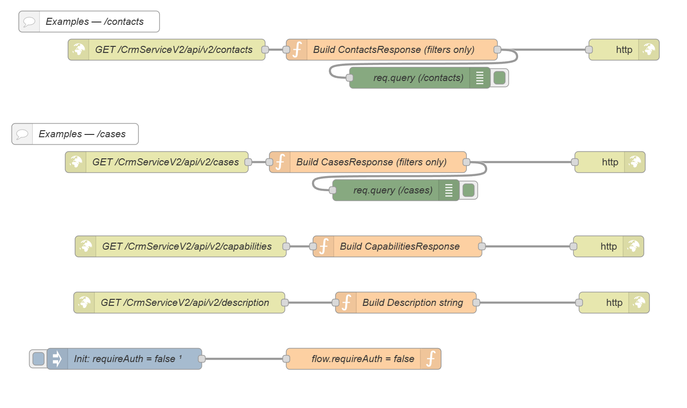

# AnywhereNow — Custom CRM Integration (Dialogue Studio Template)

This repository contains a **Dialogue Studio template** that simulates the AnywhereNow **CRM Service** contract so you can build a custom connector for your own CRM while exposing the **right endpoints** and returning the **expected response formats**. The template mirrors the GET endpoints and shapes used by CRM Service v2. See product docs: [CRM Service overview](https://golive.anywhere.now/platform_elements/crmservice/crm-service.html).

**Template file:** `awnow-customCrm-template.json` — import this into Dialogue Studio.&#x20;

---

## What this is

* A lightweight **simulation** of CRM Service v2 endpoints for **contacts** and **cases**, plus simple **capabilities**/**description** endpoints.


---

## Endpoints (provided by the template)

Base path: `/CrmServiceV2`

| Method | Path                   | Purpose                              |
| -----: | ---------------------- | ------------------------------------ |
|    GET | `/api/v2/contacts`     | Search contacts                      |
|    GET | `/api/v2/cases`        | Fetch cases by `contactId` or search |
|    GET | `/api/v2/capabilities` | List available resources             |
|    GET | `/api/v2/description`  | Plain-text descriptor                |

All of the above are implemented by the template JSON.&#x20;

---

## Request parameters

### `/api/v2/contacts` (GET)

* `q` *(required)* — free-text or phone string (the template applies a minimal E.164-ish normalizer).
* `ucc` *(optional)* — filter for tenant context; narrows results only.
* `conversationId` *(optional)* — filter for active conversation context; narrows results only.&#x20;

### `/api/v2/cases` (GET)

* `contactId` **or** `q` *(at least one required)* — either fetch by known contact or search.
* `ucc` *(optional)* — filter (narrows results).
* `conversationId` *(optional)* — filter (narrows results).&#x20;

---

## Response shapes (examples)

### ContactsResponse

```json
{
  "contacts": [
    {
      "id": "C-1001",
      "type": "person",
      "name": "Ada Lovelace",
      "url": "https://crm.example.com/contacts/C-1001",
      "image": "https://example.com/images/ada.png",
      "properties": [
        {"name":"phone","value":"+31101234567","displayValue":"+31 10 123 4567","type":"string"},
        {"name":"email","value":"ada@example.com","displayValue":"ada@example.com","type":"string"}
      ]
    }
  ]
}
```

### CasesResponse

```json
{
  "cases": [
    {
      "id": "CASE-9001",
      "url": "https://crm.example.com/cases/CASE-9001",
      "date": "2025-08-13T10:00:00.000Z",
      "status": { "value": "open", "displayValue": "Open" },
      "title": "Example case",
      "description": "Billing inquiry"
    }
  ]
}
```

These examples match the sample payloads inside the template’s function nodes.&#x20;

---

## Importing into Dialogue Studio

1. Open **Dialogue Studio** (Node-RED).
2. Menu ▸ **Import** ▸ **Select a file**.
3. Choose `awnow-customCrm-template.json`.
4. Click **Import** to add the **CrmServiceV2 Template** flow.&#x20;

> Alternative (GitHub): either download via the “Code ▸ Download ZIP” button or open the JSON file and copy via **Raw**. 

---

## Configuration

* **Auth toggle (optional):** The flow includes an `Init: requireAuth = false` inject. Change the function to `true` to enforce `Authorization: Bearer …` on requests.&#x20;
* **Search behavior:** The contacts search applies a minimal normalizer for phone-like queries and a tiny keyword demo for company names. Adjust this to your CRM’s search style. Filters `ucc`/`conversationId` currently **narrow** the result set but are not added to the payload.&#x20;
* **Extend as needed:** Wire your real CRM HTTP requests where the sample arrays are created. Keep the response shape identical to ensure WebAgent compatibility.

---

## Quick tests

Replace `{instance}` with your environment host.

**Contacts (phone):**

```bash
curl "https://{instance}/CrmServiceV2/api/v2/contacts?q=%2B31101234567&ucc=UCC001&conversationId=abc-123"
```

**Cases by contact:**

```bash
curl "https://{instance}/CrmServiceV2/api/v2/cases?contactId=C-1001"
```

**Cases (search):**

```bash
curl "https://{instance}/CrmServiceV2/api/v2/cases?q=billing&ucc=UCC001"
```

These match the built-in “Examples” **comment** nodes in the flow.&#x20;

---
